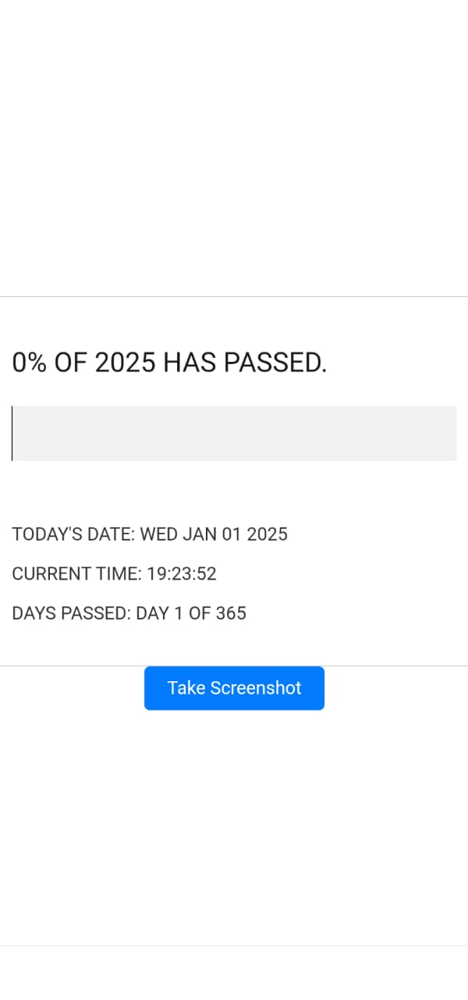

# Year Progress Bar 🌟



A dynamic web application that visualizes the progress of the year in real time. Track how much of the year has passed with engaging features like customizable screenshots, milestone alerts, and interactive updates.

## Features 🚀
- **Real-Time Updates:** Displays the current date, time, days passed, and percentage of the year completed.
- **Dynamic Progress Bar:** A visually appealing progress bar that adjusts as the year progresses.
- **Screenshot Functionality:** Capture specific parts of the progress bar with a single button click.
- **Interactive Buttons:** Smooth transitions between "Take Screenshot" and "Download Screenshot" modes.
- **Engaging Feedback:** Displays messages like "Taking Screenshot..." and "Screenshot Successful!".
- **Custom File Names:** Screenshots are saved with unique timestamps to avoid overwrites.

### Click [Here](https://teddyo323.github.io/Progress-bar_of_the_year/) to see the bar in action...


## Installation 🛠️

1. Clone the repository:
   ```bash
   git clone https://github.com/TeddyO323/Progress-bar_of_the_year.git
   cd Progress-bar_of_the_year
   ```

2. Open the `index.html` file in your browser:
   ```bash
   open index.html
   ```

## Usage 📖

1. View the progress of the year in percentage and days passed.
2. Click the **Take Screenshot** button to capture the progress bar and related information.
3. After the screenshot is captured:
   - The button changes to **Download Screenshot**. Click to download the captured image.
   - After downloading, the button resets to **Take Another Screenshot**.

## Technologies Used 🧰
- **HTML**: Structuring the content.
- **CSS**: Styling the layout and visuals.
- **JavaScript**: Implementing real-time updates, interactivity, and screenshot functionality.
- **[html2canvas](https://html2canvas.hertzen.com/)**: Capturing screenshots of DOM elements.


## Future Enhancements 🔮
- Add customization for user-defined time ranges (e.g., tracking goals or events).
- Provide light and dark themes for better accessibility.
- Include gamification features like badges and milestones.

## Contributing 🤝
Contributions are welcome! Feel free to fork the project, make changes, and submit a pull request.

---

### 📧 Contact
For any questions or feedback, feel free to reach out at **[omosh60@gmail.com](mailto:omosh60@gmail.com)**.

Enjoy tracking your year with this simple yet powerful tool! 🎉
