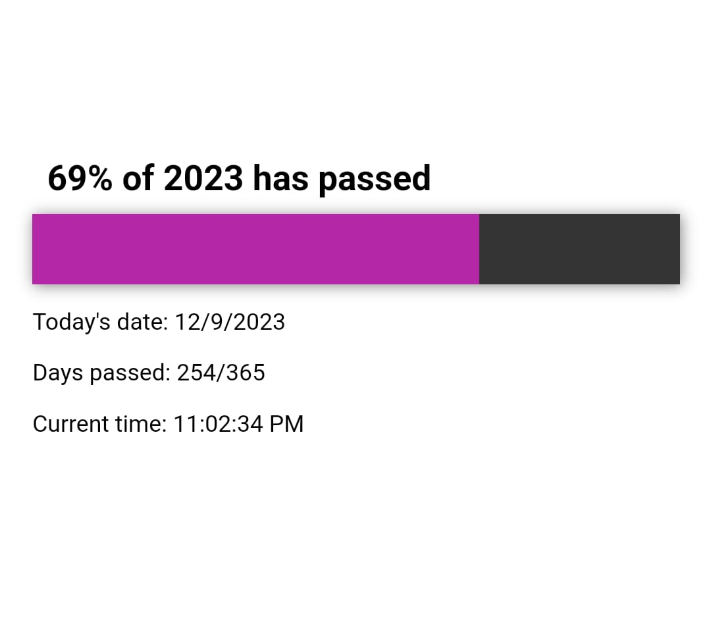

# Year Progress Bar 

This documentation provides an overview of the Year Progress Bar website, its features, and how to use and customize it.

## Table of Contents
- [Introduction](#introduction)
- [Features](#features)
- [Usage](#usage)
  - [Installation](#installation)
  - [Customization](#customization)
- [Contributing](#contributing)
- [License](#license)

### Click [Here](https://progress-bar-of-the-year.netlify.app/) to see the bar in action...

## Introduction

The Year Progress Bar website is a simple web application that displays the progress of the current year as a horizontal bar. It also provides social links and the ability to customize and extend the website.

## Features

- Year progress bar indicating the percentage of the current year that has passed.
- Social links to popular platforms (Facebook, Twitter, GitHub).
- Option to customize the website's appearance and behavior.

## Usage

### Installation

1. Clone or download the Year Progress Bar repository to your local machine.

2. Open the `index.html` file in a web browser to view the website.

### Customization

You can customize various aspects of the Year Progress Bar website:

- **Styling**: Customize the website's appearance by modifying the `style.css` file. You can change colors, fonts, and layout to match your design preferences.

## Feedback

I welcome your feedback! If you encounter issues, have suggestions for improvements, or would like to report a bug.

## Contributing

If you'd like to contribute to the Year Progress Bar project, feel free to fork the repository, make your changes, and submit a pull request. We appreciate contributions from the community.

## License

The Year Progress Bar website is open-source and available. You are free to use, modify, and distribute the code.

